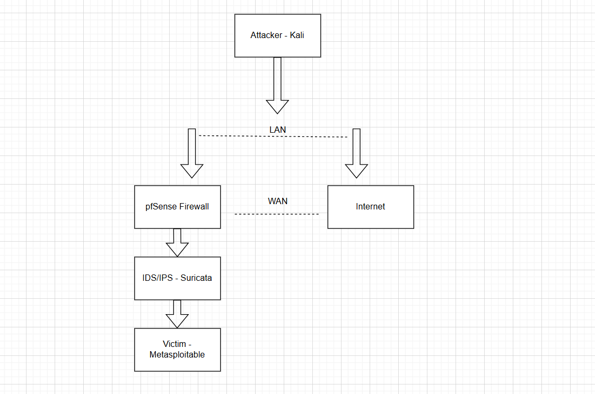
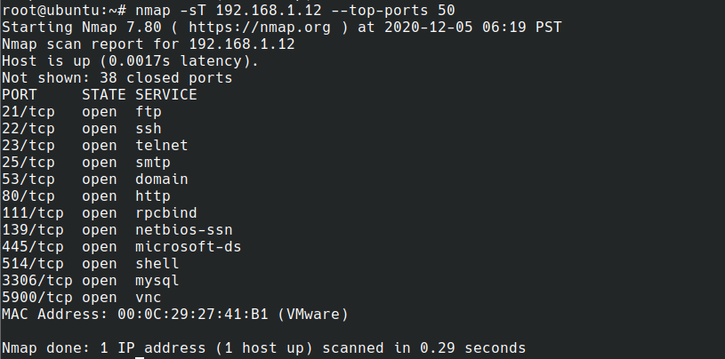
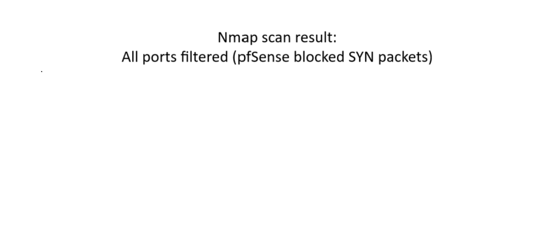
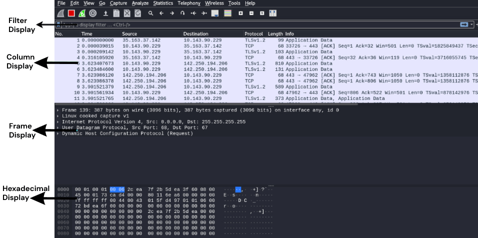

# 🛡️ Network Ninja’s Firewall Defense Hack Bootcamp

This project demonstrates a **Network Defense Toolkit** that detects and mitigates three common attacks:
1. **Port Scan** (Nmap SYN scan)
2. **SYN Flood / DDoS**
3. **DNS Tunneling**

The setup simulates a secure enterprise lab using **pfSense, Suricata, VLAN segmentation, and Wireshark analysis**.  
All configurations, rules, and evidence are documented here for reproducibility and portfolio presentation.

---

## 📌 Network Topology

- **Attacker** → Kali Linux (Nmap, hping3, DNS tunneling tools)  
- **Firewall** → pfSense (gateway/router, firewall rules)  
- **IDS/IPS** → Suricata (inline detection + logging in `eve.json`)  
- **Victim** → Metasploitable VM (target services)  

---

## 🚀 Defenses Implemented

### 🔹 1. Port Scan Defense
- **Tool:** pfSense firewall rules  
- **Attack:** Nmap SYN scan (`nmap -sS`)  
- **Defense:** Block repeated SYN packets and stealth scans  

**Evidence:**  
- Before defense (open ports visible)  
    

- After defense (all ports filtered by pfSense)  
    

---

### 🔹 2. SYN Flood / DDoS Detection
- **Tool:** Suricata with custom threshold rules  
- **Attack:** hping3 flood (`hping3 -S --flood -V -p 80 <target>`)  
- **Defense:** Suricata signature triggers alerts on repeated SYNs  

**Evidence:**  
- Alerts captured in JSON format  
  [View SYN Flood Alerts](evidence/synflood_alerts.json)  

---

### 🔹 3. DNS Tunneling + Segmentation
- **Tool:** Suricata DNS signatures + VLAN segmentation  
- **Attack:** DNS tunneling (long queries, suspicious payloads)  
- **Defense:** Detect abnormal DNS query length + restrict VLAN separation  

**Evidence:**  
- Wireshark capture of suspicious DNS queries  
    

---

